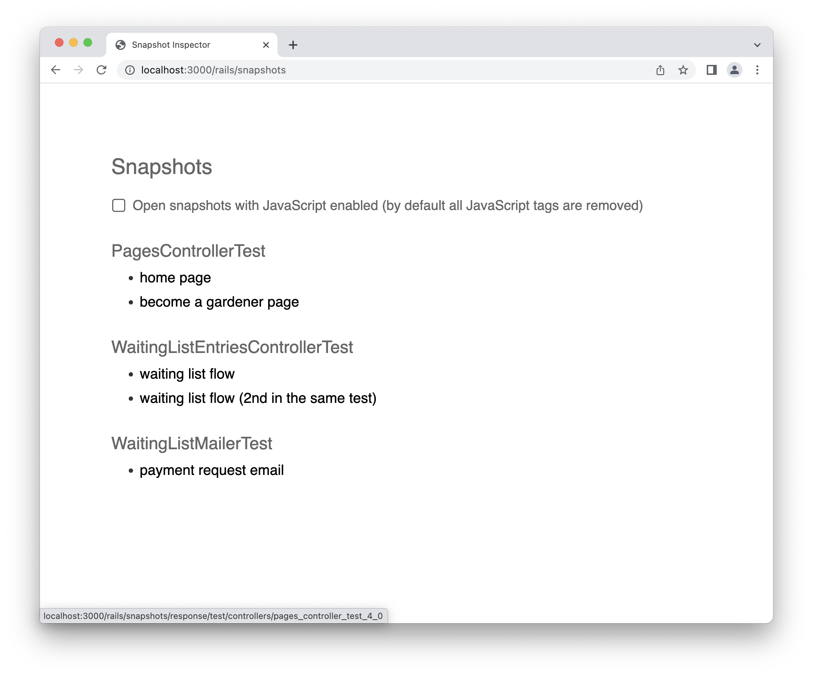
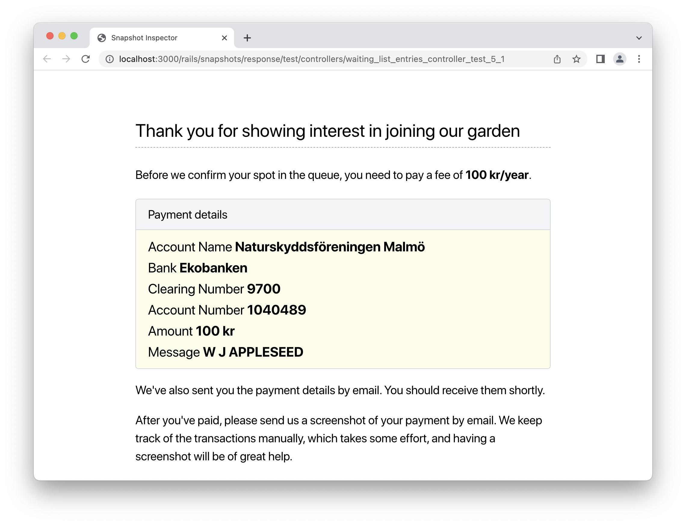
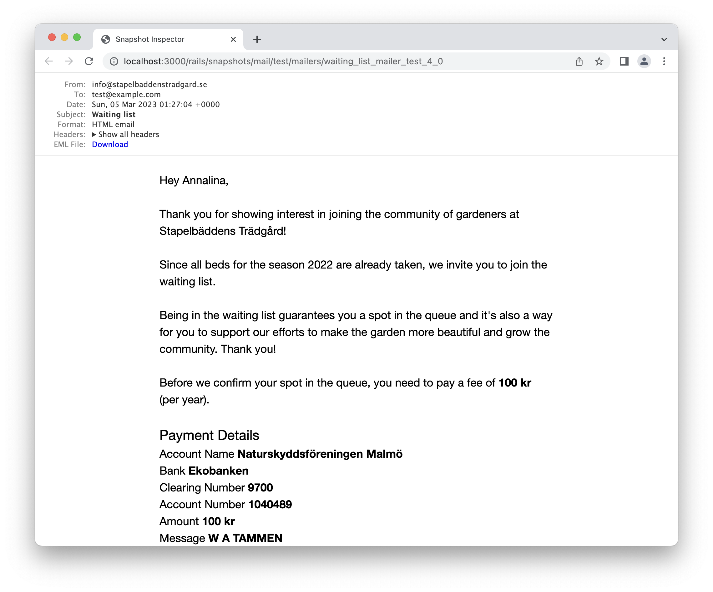

# Snapshot Inspector

Take snapshots of responses and mail messages while testing, and inspect them in a browser. A Ruby on Rails engine. Works with the default Ruby on Rails testing framework and RSpec.

> **NOTICE** 
> 
> The library is actively used during development of apps running in production, however, treat it as beta software.
>
> So far it's been tested on the latest version of Ruby on Rails (7.0.x) and Ruby (> 3.1.x).

A sneak peak into what the library is about:



## Rationale

Imagine that I'm working on a website for a local urban gardening community. It's a server side rendered
app, using sprinkles of JavaScript on top. 

While writing view related tests, like integration or mailer tests, I wish to see how the
response body (or mail message body) looks like in a browser for a given test setup.

It's quite easy to do that in some cases. Let's say I'm writing an integration test for a form for signing
up gardeners to the garden's waiting list.
I can simply start the development server, go to a URL of the page that displays the form
and I can see and inspect the rendered HTML that exactly reflects the response body I'm dealing
with in the integration test.

Now imagine I'm writing an integration test for a success page that is displayed after a new gardener fill
in the form and submits it. Or imagine, that I'm writing a test for a membership details page of 
an expired membership that is visible only to a specific registered gardener.

In such cases I need to put much more effort into recreating the state in a browser I already put effort
into creating in the test setup in the first place. 

In JavaScript heavy applications it's natural to use system tests (or similar) for such purposes. It's possible
to [take screenshots](https://api.rubyonrails.org/classes/ActionDispatch/SystemTesting/TestHelpers/ScreenshotHelper.html#method-i-take_screenshot),
and even save HTML of the page being screenshotted for later inspection.

However, in the world of server rendered applications with sprinkles of JavaScript on top, the integration tests
(where a system under test deals with controller/model/view) can cover a lot of the testing needs that
in JavaScript heavy context can only be fulfilled with system tests (javascript/controller/model/view
running via a browser).

It would be convenient to use integration tests for such cases since they are much faster to run. However,
writing assertions against HTML can become quickly cumbersome because of the reasons explained above.

Alternatively, I could use a debugger to inspect the state of a response body thought a shell,
but that makes me feel like peeking through a peephole compared to inspecting HTML with a Web Inspector.

Enter **Snapshot Inspector**.

All that is keeping me away from using Web Inspector for such purposes is one drop of a line

```ruby
take_snapshot response
```

after a request is made in a test and a response object has been populated.

Take a look at an example of a rendered response snapshot of a thank you page in a browser:



### Exploring a new codebase

Imagine you are new to a codebase (or it's been months since you've looked at it) and you
are investigating a reported UI bug. You know to which route
the bug is related to, but since you haven't worked in that area of the codebase, it's not clear how
to recreate the state of the application in a browser to replicate the bug. Maybe you don't even know
how the UI related to the route actually looks like, since you haven't managed to click around
through all the permutations of state of the whole application.

With Snapshot Inspector, you can simply drop a bunch of `take_snapshot response` in all the tests
of the related controller, and you'll get a pretty good picture of how the UI looks like.
That might actually be all you need to do to replicate the bug. Or you can create a new test that
will replicate the state of the UI the bug reporter was in, and generate snapshots as you explore.

### A case for taking snapshots of mail messages

There is an established practice of using [Action Mailer Previews](https://guides.rubyonrails.org/action_mailer_basics.html#previewing-emails).

Imagine that I'm working on a mailer that I wish to send to a gardener that has signed up for the
waiting list.

Without Snapshot Inspector I would write the mailer test and the mailer preview. I would need to
do the same setup of the mailer state twice to keep the parity between the two.

With Snapshot Inspector, I can simply drop one line of code into the mailer test and avoid writing
the mailer preview altogether.

```ruby
take_snapshot mail
```

An example of a rendered mail message snapshot of a thank you email in a browser:



The duplicated effort between mailer previews and tests is gone. I can look and inspect all
interesting variations of a mailer that I'm already testing anyhow, without putting any effort into
creating previews.

### Summary

Taking snapshots is to integration and mailer tests what taking screenshots is to system tests.

### The added bonus: UI library

While not the primary goal of the Snapshot Inspector, a side effect of taking snapshots is a library
of the UI surface area of the application.

One of the benefits of automated tests with well written test descriptions is to document the
behaviour of a system under test. Since the output of a system under test in case of integration
and mailer tests is a renderable UI, if we take snapshots of all tested responses and emails, we
consequently generate a browsable UI library of the whole application.

Of course, that only applies to applications that are heavy on the server side rendering and use
a tiny bit of JavaScript on top. In the world of [Hotwire](https://hotwired.dev) I imagine there can
be quite a few applications like that.

## Installation

Add the gem to your application's Gemfile under `:development` and `:test` groups. Snapshots are taken in the test environment and inspected in the development environment.

```ruby
group [:development, :test] do
  gem "snapshot_inspector"
end
```

Then execute:
```bash
bundle install
```

## Usage

Take snapshots by placing a helper method `take_snapshot` in tests that deal with instances of `ActionDispatch::TestResponse` or `ActionMailer::MessageDelivery`.
For example, in controller, integration or mailer tests.

For the best experience, take snapshots before assertions. That way it is possible to inspect them as part of the investigation why an assertion failed.

An example from an integration test:

```ruby
test "should get index" do
  get root_path
  
  take_snapshot response # <-- takes a snapshot of the response (an instance of ActionDispatch::TestResponse)
  
  assert_response :success
end
```

An example in a mailer test:

```ruby
test "welcome mail" do
  mail = NotifierMailer.welcome

  take_snapshot mail # <-- takes a snapshot of the mail (an instance of ActionMailer::MessageDelivery)

  assert_equal "Welcome!", mail.subject
end
```

When the tests are run, to avoid the performance overhead, the snapshots taking is skipped by default.
To enable them, run the tests with a flag `--take-snapshots`. The flag works with the default testing framework only.

```bash
bin/rails test --take-snapshots
TAKE_SNAPSHOTS=1 bin/rails test
```

If you are using RSpec, use the environment variable `TAKE_SNAPSHOTS`. The variable also works with the default testing framework.

```bash
TAKE_SNAPSHOTS=1 bin/rspec
```

Then start your local server and visit http://localhost:300/rails/snapshots.

### Live Reloading

If you wish for the snapshots in a browser to live reload whenever a test run is completed,
Snapshot Inspector works out of box with [hotwire-livereload](https://github.com/kirillplatonov/hotwire-livereload).
Besides the general installation instructions, add the following lines into `development.rb`.

```ruby
config.hotwire_livereload.listen_paths << SnapshotInspector::Storage.snapshots_directory
config.hotwire_livereload.force_reload_paths << SnapshotInspector::Storage.snapshots_directory
```

## How it works

- By default, snapshot taking is skipped to preserve the performance of the test suit in CI and similar environments. 
- Snapshots are stored in `tmp/snapshot_inspector` folder.
- For every test run, existing snapshots are cleared and new snapshots are generated.
- The testing framework (Rails' default or RSpec) is autodetected.
- By default, when a snapshot is rendered all JavaScript related tags (`<script>` and `<link>`) are removed
  from the HTML. That way we can pretty closely simulate how a page looks like with JavaScript turned off
  without going into trouble of turning it off in a browser, and still taking advantage of live reloading.

## Unresolved Challenges

Imagine that you are building a page with form. You wish to test drive the development while at the
same time use the Snapshot Inspector to see how the page looks like after every change.

It takes more time to make a change in the view, run the test (and generate a snapshot),
and to reload the browser, than to run a development server and use live reloading directly.
Even with live reloading turned on and using things like [guard](https://github.com/guard/guard).

It would be nice to find a way how to speed up running tests. Perhaps there is a way to run them
interactively from a console and to run something similar to `reload!` after every change? Please reach out
via Github Issues if you have suggestions.

## Contributing

- Fork the repo
- Create your feature branch (git checkout -b my-new-feature)
- Commit your changes (git commit -am 'Add some feature')
- Push to the branch (git push origin my-new-feature)
- Create a new Pull Request

## License
The gem is available as open source under the terms of the [MIT License](https://opensource.org/licenses/MIT).
