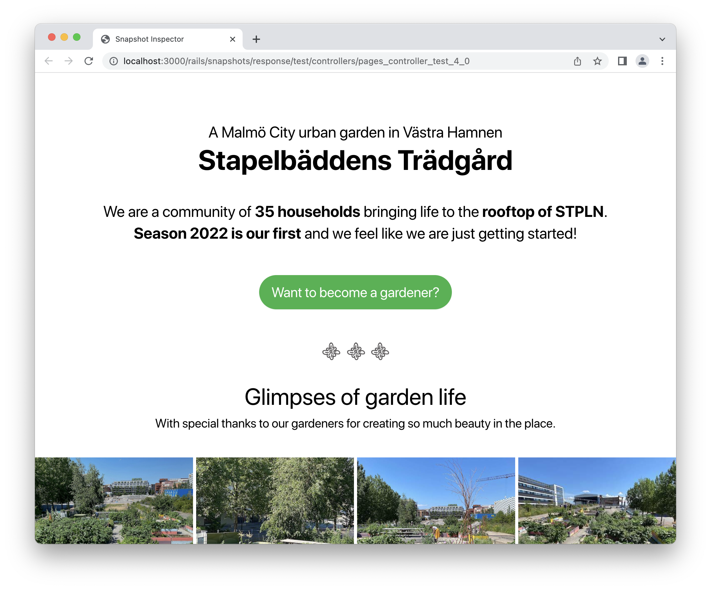

# Snapshot Inspector

Take snapshots of responses and mail messages while testing, and inspect them in a browser. A Ruby on Rails engine. Works with the default Ruby on Rails testing framework and RSpec.

> **NOTICE:** the library is actively used during development of apps running in production, however, deem it as beta software.

## Rationale

...


### A case for response snapshots

...



### A case for mail message snapshots

...


## Installation
Add the gem to your application's Gemfile under `:development` and `:test` groups. Snapshots are taken in the test environment and inspected in the development environment.

```ruby
group [:development, :test] do
  gem "snapshot_inspector"
end
```

Then execute:
```bash
bundle install
```

## Usage

Take snapshots by placing a helper method `take_snapshot` in tests that deal with instances of `ActionDispatch::TestResponse` or `ActionMailer::MessageDelivery`.
For example, in controller, integration or mailer tests.

For the best experience, take snapshots before assertions. That way it is possible to inspect them as part of the investigation why an assertion failed.

An example from an integration test:

```ruby
test "should get index" do
  get root_path
  
  take_snapshot response # <-- takes a snapshot of the response (instance of ActionDispatch::TestResponse)
  
  assert_response :success
end
```

An example in mailer test:

```ruby
test "welcome mail" do
  mail = NotifierMailer.welcome

  take_snapshot mail # <-- takes a snapshot of the mail (instance of ActionMailer::MessageDelivery)

  assert_equal "Welcome!", mail.subject
end
```

When tests are run, the snapshots aren't taken by default to avoid the performance overhead.
To enable them, run tests with a flag `--take-snapshots`. The flag works with the default testing framework only.

```bash
bin/rails test --take-snapshots
TAKE_SNAPSHOTS=1 bin/rails test
```

If you are using RSpec, use the environment variable `TAKE_SNAPSHOTS`. The variable also works with the default testing framework.

```bash
TAKE_SNAPSHOTS=1 bin/rspec
```

Start your local server and visit http://localhost:300/rails/snapshots.

### Live Reload

If you wish for the snapshots in a browser to live reload, use a library like [hotwire-livereload](https://github.com/kirillplatonov/hotwire-livereload).
Besides the general installation instructions, add the following lines into `development.rb`.

```ruby
config.hotwire_livereload.listen_paths << SnapshotInspector::Storage.snapshots_directory
config.hotwire_livereload.force_reload_paths << SnapshotInspector::Storage.snapshots_directory
```

## Contributing

- Fork the repo
- Create your feature branch (git checkout -b my-new-feature)
- Commit your changes (git commit -am 'Add some feature')
- Push to the branch (git push origin my-new-feature)
- Create a new Pull Request

## License
The gem is available as open source under the terms of the [MIT License](https://opensource.org/licenses/MIT).
